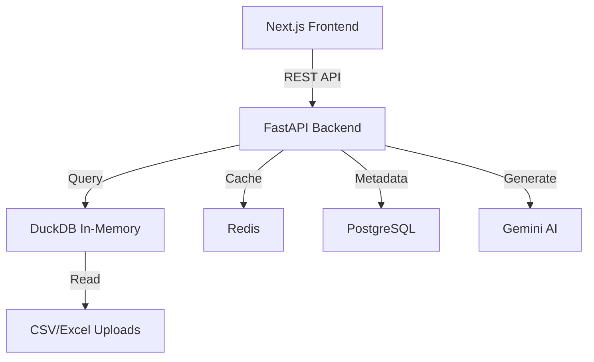

# Enterprise Analytics Platform

A high-performance, AI-enhanced data analytics platform built for scale.
Designed with **Next.js 14**, **FastAPI**, **DuckDB**, and **Magic UI**.


## 🚀 Key Features

*   **⚡ High Performance**: In-memory dataframe caching and stateless DuckDB execution for handling large datasets (1M+ rows) with low latency.
*   **🎨 Premium UX**: Beautiful "Magic UI" dashboard with animated cards, glassmorphism, and responsive design.
*   **🤖 AI-Powered**: 
    *   **Ask Data**: Chat with your datasets using natural language (powered by Gemini).
    *   **Automated Insights**: Get automatic trend analysis and outlier detection.
*   **🛡️ Robust Monitoring**: Real-time data quality checks (Freshness, Nulls, Duplicates) with dashboard alerts.
*   **📄 Export Reports**: Generate PDF reports of your analysis with one click.
*   **🐳 Production Ready**: Fully Dockerized stack for easy deployment.

## 🛠️ Tech Stack

*   **Frontend**: Next.js 14 (App Router), TypeScript, TailwindCSS, Magic UI, Recharts.
*   **Backend**: FastAPI (Python), DuckDB, Pandas, SQLAlchemy.
*   **Database**: PostgreSQL 15, Redis (Caching).
*   **Infrastructure**: Docker, Docker Compose.

## 🏗️ Architecture



## 🏁 Getting Started

### Prerequisites
- Docker Desktop installed.

### 1-Click Deployment
1.  Clone the repository.
2.  Run the stack:
    ```bash
    docker-compose up --build
    ```
3.  Access the platform:
    *   **Frontend**: [http://localhost:3000](http://localhost:3000)
    *   **Backend API**: [http://localhost:8002/docs](http://localhost:8002/docs)

## 📂 Project Structure

- `/frontend`: Next.js application with Shadcn/UI components.
- `/backend`: Python FastAPI application structured by `api/v1`, `core`, and `engine`.
- `/docker-compose.yml`: Definition of services (Frontend, Backend, DB, Redis).

## 🛡️ License

MIT
